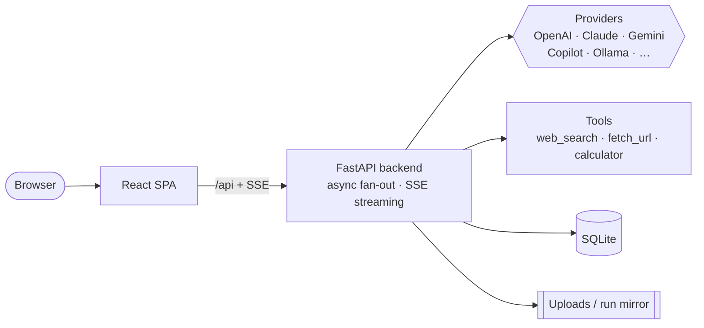

<div align="center">

# 💬 MultiChat

**Broadcast one prompt to many AI models and watch them answer side-by-side — live.**
A multi-model compare workbench: fan a single prompt out to 2–6 models at once, stream
every answer concurrently, then let a Judge lane synthesize the best one. Bring your own
providers (API key **or** OAuth), call tools, run evals, and track it all on an insights
dashboard.

[](https://github.com/zmustafa/MultiChat/actions/workflows/ci.yml)
[](LICENSE)
[](backend/requirements.txt)
[](frontend/package.json)
[](frontend/tsconfig.json)
[](https://fastapi.tiangolo.com/)
[](CONTRIBUTING.md)

[Features](#-features) · [Screenshots](#-screenshots) · [Quick start](#-quick-start-local) · [How it works](#-how-it-works) · [Tech stack](#-tech-stack) · [Docs](#-documentation)

> 🆕 **Latest:** parallel evaluations (5 lanes at once) with **time-to-first-token** &
> **tokens/sec** metrics, a full **Insights** dashboard (token usage, cost, provider mix,
> activity), and new providers (**OpenAI EU**, **Azure Foundry**).

<!-- Add a hero screenshot at docs/assets/hero.png -->


</div>

---

> [!IMPORTANT]
> This is an unofficial project and is **not affiliated with or endorsed by** OpenAI,
> Anthropic, Google, Microsoft/GitHub, or any model provider. You bring your own
> accounts and API keys; you are responsible for complying with each provider's terms.

## Why MultiChat?

Picking the "best" model is guesswork when you only ever see one answer at a time.
**MultiChat puts them head-to-head** — one prompt fans out to every lane, each streams
live in its own column, and a **Judge** lane can merge them into a single best answer.
It's not just a chat box: enable **tools** (web search, fetch URL, calculator), run a
**suite of evals** across many models with latency/throughput scoring, and watch usage,
cost, and provider mix on an **Insights** dashboard — all running locally against your
own keys.

- 🏟️ **Compare, not one-at-a-time** — broadcast a prompt to 2–6 lanes and read every model's answer concurrently, with a **Diff** view to spot differences.
- 🔌 **Bring your own provider** — OpenAI, Azure OpenAI, Azure Foundry, Anthropic, Gemini, GitHub Copilot, Ollama, OpenAI-compatible — via **API key or OAuth sign-in** (ChatGPT / Claude / Copilot).
- ⚖️ **Agentic tools + a Judge** — models call web search / fetch / calculator with a persisted tool-call timeline, and a Judge lane synthesizes the strongest answer.
- 🧪 **Evals & 📊 Insights built in** — run prompt × model grids in parallel with score, TTFT and tok/s; track token usage, estimated cost, and activity trends over time.
- 🏠 **Local-first & private** — runs on your machine via Docker or natively; keys are encrypted at rest and **never** sent to the browser.

> Built for developers, prompt engineers, and AI power users who want to compare and trust their models.

## Table of Contents

- [Features](#-features)
- [Screenshots](#-screenshots)
- [Quick start (local)](#-quick-start-local)
- [How it works](#-how-it-works)
- [Tech stack](#-tech-stack)
- [Security notes](#-security-notes)
- [Documentation](#-documentation)
- [Contributing](#-contributing)
- [License](#-license)

## ✨ Features

<table>
<tr>
<td width="50%" valign="top">

### 🏟️ Multi-model compare
Broadcast one prompt to **2–6 lanes** and watch each model stream **concurrently** in its
own column. Target a single lane, resend to all, or regenerate — a single chat is just a
one-lane session.

</td>
<td width="50%" valign="top">

### ⚡ Live streaming fan-out
An async fan-out engine streams every lane over **SSE** at once. Disconnect and reconnect
mid-run — answers keep generating **server-side** and resume from a disk-backed mirror.

</td>
</tr>
<tr>
<td width="50%" valign="top">

### 🛠️ Tool calling
Models can call **web_search** (Brave), **fetch_url** (SSRF-guarded, size-capped), and a
safe **calculator** — with a per-message reasoning + tool-call timeline that persists
across reloads and shows a live preview of each call.

</td>
<td width="50%" valign="top">

### ⚖️ Judge / synthesizer
Turn on a **Judge** lane to merge every model's answer into one best response — then
**copy**, download as **Markdown**, or export to **PDF**.

</td>
</tr>
<tr>
<td width="50%" valign="top">

### 🧪 Evaluations
Run a **prompt × model** grid **in parallel** (5 at a time) with live progress. Each cell
is scored 1–10 by a judge model and reports **latency**, **time-to-first-token**, and
**tokens/sec** — all sortable, with regression tracking across runs.

</td>
<td width="50%" valign="top">

### 📊 Insights dashboard
At-a-glance **token usage & estimated cost**, provider mix, tool-calls by status/kind,
activity over 7 days / 24 hours, a weekday×hour punch-card, top tools, and most-active
chats — filterable by time range.

</td>
</tr>
<tr>
<td width="50%" valign="top">

### 🔌 Bring your own AI
**OpenAI · OpenAI EU · Azure OpenAI · Azure Foundry · Anthropic · Gemini · GitHub
Copilot · Ollama · OpenAI-compatible** — switchable per lane, via **API key** or **OAuth
sign-in** (ChatGPT, Claude Pro/Max, Copilot). Keys are encrypted and disabled until set.

</td>
<td width="50%" valign="top">

### 🖼️ Rich rendering
**Markdown + GFM**, syntax-highlighted code with collapse, **Mermaid** diagrams (export to
PNG), and **image vision** input for models that support it.

</td>
</tr>
<tr>
<td width="50%" valign="top">

### 🎭 Personas & snippets
Save reusable **lane presets** (a set of providers/models) as personas, and keep a library
of prompt **snippets** to drop into the composer.

</td>
<td width="50%" valign="top">

### 💾 Export, import & backup
Export a comparison to **Markdown / Word / PDF / JSON**, import sessions, and take a full
encrypted **system backup** of everything from Settings.

</td>
</tr>
</table>

### Local & private

🔒 Keys Fernet-encrypted at rest · 🧾 never sent to the browser · 👤 JWT auth, per-owner
scoping · 🛡️ SSRF-guarded fetch · 🏠 runs entirely on your machine (Docker or native).

## 📸 Screenshots

<!-- Replace the placeholder images below with real captures in docs/assets/. -->

<table>
<tr>
<td width="50%"><br/><sub><b>Compare grid</b> — one prompt streaming across several model lanes at once.</sub></td>
<td width="50%"><br/><sub><b>Judge</b> — synthesize the best answer, then copy / export to Markdown or PDF.</sub></td>
</tr>
<tr>
<td width="50%"><br/><sub><b>Evals</b> — prompt × model grid run in parallel with score, TTFT & tok/s.</sub></td>
<td width="50%"><br/><sub><b>Insights</b> — token usage, estimated cost, provider mix & activity trends.</sub></td>
</tr>
<tr>
<td width="50%"><br/><sub><b>Providers</b> — bring your own model via API key or OAuth; encrypted at rest.</sub></td>
<td width="50%"><br/><sub><b>Tools</b> — web search / fetch with a persisted, previewable tool-call timeline.</sub></td>
</tr>
</table>

## ⚡ Quick start (local)

**Prerequisites:** Docker Desktop (or Python 3.11 + Node 20 for native dev).

```bash
# 1) Configure environment
cp .env.example .env
# Generate a Fernet key and paste it into APP_ENCRYPTION_KEY:
python -c "from cryptography.fernet import Fernet;print(Fernet.generate_key().decode())"
# Also set a strong JWT_SECRET (don't ship the default).

# 2) Run the whole stack
docker compose up --build
```

Open **http://localhost:5000**. The API + interactive docs live at
**http://localhost:5001/docs**.

A default account is seeded on first run — sign in with **admin / admin**, then
**change the password immediately** before exposing the app (see [Security notes](#-security-notes)).

<details>
<summary><b>Native dev (without Docker)</b></summary>

**Backend**

```bash
cd backend
python -m venv .venv
. .venv/Scripts/Activate.ps1     # Windows PowerShell
pip install -r requirements.txt
$env:APP_ENCRYPTION_KEY = (python -c "from cryptography.fernet import Fernet;print(Fernet.generate_key().decode())")
$env:JWT_SECRET = "dev-secret"
uvicorn app.main:app --reload --port 5001
```

**Frontend**

```bash
cd frontend
npm install
npm run dev        # http://localhost:5000  (reads VITE_API_BASE, default http://localhost:5001)
```

</details>

### Using the app

1. **Sign in** (admin / admin on first run).
2. **Settings → Add provider** (e.g. OpenAI) with an API key or OAuth, then **Test**.
3. On **Compare**, create a topic and **Add lane** (provider + model) 2–6 times.
4. Type a prompt and **Send** — it broadcasts to all lanes and each streams live.
5. Optional: enable **Tools**, turn on a **Judge** lane, open **Evals** / **Insights**,
   switch to **Diff** view, export/import, or toggle dark mode.

## 🧩 How it works

The React SPA talks to a FastAPI backend that fans one prompt out to every lane in
parallel and streams tokens back over SSE. All provider and tool calls are proxied by the
backend — the browser never holds a key.



The fan-out streaming engine is `backend/app/broadcast.py`; providers live under
`backend/app/providers/`, tools under `backend/app/tools/`, and the UI under
`frontend/src/`.

## 🔧 Tech stack

| Layer | Tech |
| --- | --- |
| **Frontend** | React 18 · TypeScript · Vite · Tailwind · React Router · TanStack Query · react-markdown (GFM + highlight) · Mermaid · native fetch + SSE |
| **Backend** | Python 3.11 · FastAPI · Uvicorn · SQLAlchemy 2 · Pydantic v2 · httpx (async) · asyncio fan-out |
| **Auth & secrets** | passlib[bcrypt] · python-jose (JWT) · cryptography (Fernet at rest) |
| **AI** | Provider abstraction with streaming + normalized tool-calls; API key or OAuth |
| **Data** | SQLite · local file storage for uploads & run mirrors |
| **Infra** | Docker + docker-compose |

## 🔐 Security notes

MultiChat is designed to be **self-hosted and run by a trusted user (or small trusted
team) against their own provider keys.** It is *not* hardened for hostile, multi-tenant,
or public-internet exposure. Please keep that threat model in mind before deploying it
somewhere untrusted users can reach.

**What's protected**

- **Secrets.** Provider API keys and tool secrets are **Fernet-encrypted at rest** and
  never returned in plaintext (masked + `has_key`). The browser never holds a key.
- **Auth.** Passwords are bcrypt-hashed; access is JWT bearer (24h). Every data route is
  auth-scoped to the owner (cross-user access → 404). A weak/absent `JWT_SECRET` is
  auto-replaced at startup with a generated one persisted outside the repo.
- **Egress.** `fetch_url` / `web_search` block private/loopback/link-local addresses and
  cap response size.
- **Imports.** Backup/restore rejects path-traversal (Zip-Slip) member names.

**Before exposing it beyond localhost**

- Set a strong random `JWT_SECRET`, generate a unique `APP_ENCRYPTION_KEY`, and change
  the seeded **admin/admin** password — the defaults are for local development only.
- Put it behind TLS and, ideally, your own auth proxy.

**Known limitations (by design / not yet hardened)**

- **Integrations run local processes.** Connecting an MCP integration (e.g. WorkIQ)
  launches a local subprocess with the server's privileges — only connect servers you
  trust. Treat an authenticated account as able to run code on the host.
- **SSRF on redirects.** `fetch_url` validates the initial URL but follows redirects;
  a hostile server could redirect toward internal addresses. Don't expose it to
  untrusted users on a sensitive network.
- **No login rate-limiting** and **unauthenticated capability URLs** for uploaded files
  (long unguessable UUIDs). Fine for local/trusted use; harden before public exposure.

Found a vulnerability? Please follow [SECURITY.md](SECURITY.md) — don't open a public issue.

## ⚙️ Configuration (`.env`)

| Var | Purpose |
| --- | --- |
| `APP_ENCRYPTION_KEY` | Fernet key used to encrypt provider/tool secrets at rest |
| `JWT_SECRET` | Secret for signing JWT access tokens |
| `DATABASE_URL` | SQLAlchemy URL (default SQLite file) |
| `FRONTEND_ORIGIN` | Allowed CORS origin |
| `UPLOAD_DIR` | Where uploaded images/documents are stored |

See [`.env.example`](.env.example) for the full, commented list.

## 📚 Documentation

| Doc | What's inside |
| --- | --- |
| [TECHNICAL_SPEC.md](docs/TECHNICAL_SPEC.md) | Architecture, SSE fan-out engine, data model, request flow |
| [CONTRIBUTING.md](CONTRIBUTING.md) | Local dev, type-check/build, PR guidelines |
| [SECURITY.md](SECURITY.md) | Vulnerability disclosure policy & hardening notes |
| [CODE_OF_CONDUCT.md](CODE_OF_CONDUCT.md) | Community guidelines |

## 🤝 Contributing

Contributions are welcome! Please read [CONTRIBUTING.md](CONTRIBUTING.md) and our
[Code of Conduct](CODE_OF_CONDUCT.md). Good first steps: open an issue to discuss a
change, keep PRs focused, and make sure the frontend type-checks/builds and the backend
byte-compiles.

## 📄 License

[MIT](LICENSE) © 2026 Zeeshan Mustafa ([@zmustafa](https://github.com/zmustafa))

## 🙏 Acknowledgements

- [FastAPI](https://fastapi.tiangolo.com/) · [React](https://react.dev/) · [Vite](https://vitejs.dev/) · [Tailwind CSS](https://tailwindcss.com/) — the core stack.
- [Mermaid](https://mermaid.js.org/) for diagram rendering, [highlight.js](https://highlightjs.org/) for code.
- Brand icons from [Simple Icons](https://simpleicons.org/) (CC0).
- The model providers whose APIs make the comparisons possible.

<div align="center"><sub>If this project helps you, consider giving it a ⭐ — it helps others find it.</sub></div>
