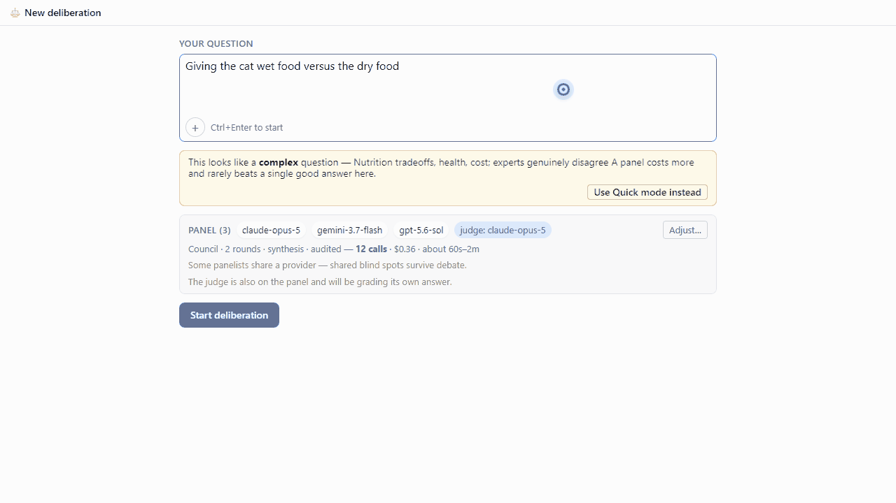
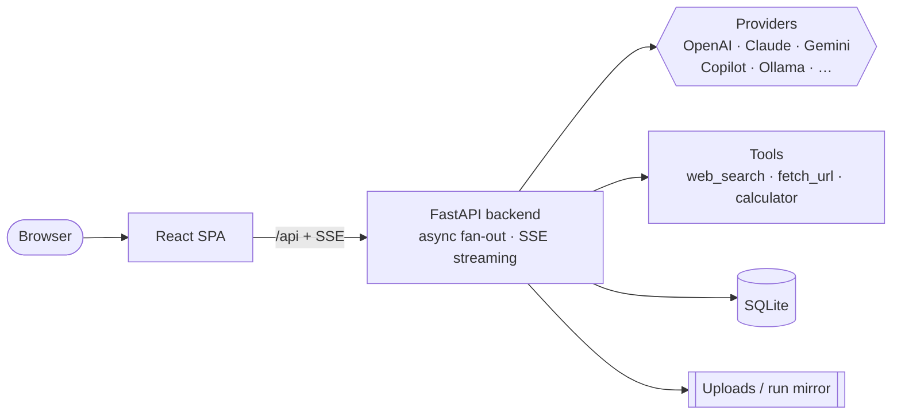
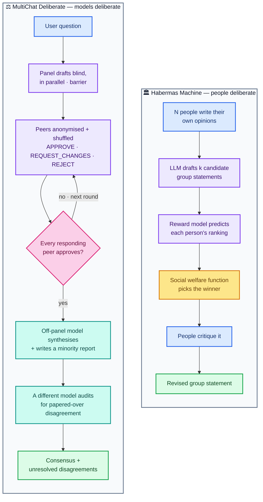

<div align="center">

# 💬 MultiChat

**Broadcast one prompt to many AI models and watch them answer side-by-side — live.**
A multi-model workbench with two modes: **compare** — fan a single prompt out to 2–6 models
and stream every answer concurrently, then let a Judge lane synthesize the best one; or
**deliberate** — an AI-only **Habermas Machine** that convenes those same models as a panel:
blind drafts, anonymous peer review, an explicit convergence gate, and a minority report of
what they never agreed on. Bring your own providers (API key **or** OAuth), call tools, run
evals, and track it all on an insights dashboard.

[](https://github.com/zmustafa/MultiChat/actions/workflows/ci.yml)
[](LICENSE)
[](backend/requirements.txt)
[](frontend/package.json)
[](frontend/tsconfig.json)
[](https://fastapi.tiangolo.com/)
[](CONTRIBUTING.md)

[Features](#-features) · [Screenshots](#-screenshots) · [Quick start](#-quick-start-local) · [Connect providers](#-connect-your-ai-providers) · [How it works](#-how-it-works) · [Deliberation](#-model-deliberation--the-research-behind-it) · [Tech stack](#-tech-stack) · [Docs](#-documentation)

> 🆕 **Latest:** **Deliberation** — convene 2–5 models as a panel (an AI-only *Habermas
> Machine*): blind drafts, anonymous claim-level review, an approval gate, a synthesis with
> a **minority report**, and a JSON **audit trail** of every step. Chats and panels now
> share one sidebar.


</div>

---

> [!IMPORTANT]
> This is an unofficial project and is **not affiliated with or endorsed by** OpenAI,
> Anthropic, Google, Microsoft/GitHub, or any model provider. You bring your own
> accounts and API keys; you are responsible for complying with each provider's terms.

## Why MultiChat?

Picking the "best" model is guesswork when you only ever see one answer at a time.
**MultiChat puts them head-to-head** — one prompt fans out to every lane, each streams
live in its own column, and a **Judge** lane can merge them into a single best answer.
When the *disagreement* is the point, switch to **Deliberate** and the same models become
a panel that has to justify everything it rejects.
It's not just a chat box: enable **tools** (web search, fetch URL, calculator), run a
**suite of evals** across many models with latency/throughput scoring, and watch usage,
cost, and provider mix on an **Insights** dashboard — all running locally against your
own keys.

- 🏟️ **Compare, not one-at-a-time** — broadcast a prompt to 2–6 lanes and read every model's answer concurrently, with a **Diff** view to spot differences.
- ⚖️ **Deliberate, don't just compare** — convene the models as a panel (an AI-only **Habermas Machine**): blind drafts, anonymous peer review, an explicit convergence gate, and a minority report when they don't agree.
- 🔌 **Bring your own provider** — OpenAI, Azure OpenAI, Azure Foundry, Anthropic, Gemini, GitHub Copilot, Ollama, OpenAI-compatible — via **API key or OAuth sign-in** (ChatGPT / Claude / Copilot).
- ⚖️ **Agentic tools + a Judge** — models call web search / fetch / calculator with a persisted tool-call timeline, and a Judge lane synthesizes the strongest answer.
- 🧪 **Evals & 📊 Insights built in** — run prompt × model grids in parallel with score, TTFT and tok/s; track token usage, estimated cost, and activity trends over time.
- 🏠 **Local-first & private** — runs on your machine via Docker or natively; keys are encrypted at rest and **never** sent to the browser.

> Built for developers, prompt engineers, and AI power users who want to compare and trust their models.

## Table of Contents

- [Features](#-features)
- [Screenshots](#-screenshots)
- [Quick start (local)](#-quick-start-local)
- [Connect your AI providers](#-connect-your-ai-providers)
- [How it works](#-how-it-works)
- [Deliberation — the research behind it](#-model-deliberation--the-research-behind-it)
- [Tech stack](#-tech-stack)
- [Security notes](#-security-notes)
- [Documentation](#-documentation)
- [Contributing](#-contributing)
- [License](#-license)

## ✨ Features

<table>
<tr>
<td width="50%" valign="top">

### 🏟️ Multi-model compare
Broadcast one prompt to **2–6 lanes** and watch each model stream **concurrently** in its
own column. Target a single lane, resend to all, or regenerate — a single chat is just a
one-lane session.

</td>
<td width="50%" valign="top">

### ⚡ Live streaming fan-out
An async fan-out engine streams every lane over **SSE** at once. Disconnect and reconnect
mid-run — answers keep generating **server-side** and resume from a disk-backed mirror.

</td>
</tr>
<tr>
<td width="50%" valign="top">

### 🛠️ Tool calling
Models can call **web_search** (Brave), **fetch_url** (SSRF-guarded, size-capped), and a
safe **calculator** — with a per-message reasoning + tool-call timeline that persists
across reloads and shows a live preview of each call.

</td>
<td width="50%" valign="top">

### ⚖️ Judge / synthesizer
Turn on a **Judge** lane to merge every model's answer into one best response — then
**copy**, download as **Markdown**, or export to **PDF**.

</td>
</tr>
<tr>
<td width="50%" valign="top">

### 🧪 Evaluations
Run a **prompt × model** grid **in parallel** (5 at a time) with live progress. Each cell
is scored 1–10 by a judge model and reports **latency**, **time-to-first-token**, and
**tokens/sec** — all sortable, with regression tracking across runs.

</td>
<td width="50%" valign="top">

### 📊 Insights dashboard
At-a-glance **token usage & estimated cost**, provider mix, tool-calls by status/kind,
activity over 7 days / 24 hours, a weekday×hour punch-card, top tools, and most-active
chats — filterable by time range.

</td>
</tr>
<tr>
<td width="50%" valign="top">

### 🔌 Bring your own AI
**OpenAI · OpenAI EU · Azure OpenAI · Azure Foundry · Anthropic · Gemini · GitHub
Copilot · Ollama · OpenAI-compatible** — switchable per lane, via **API key** or **OAuth
sign-in** (ChatGPT, Claude Pro/Max, Copilot). Keys are encrypted and disabled until set.

</td>
<td width="50%" valign="top">

### 🖼️ Rich rendering
**Markdown + GFM**, syntax-highlighted code with collapse, **Mermaid** diagrams (export to
PNG), and **image vision** input for models that support it.

</td>
</tr>
<tr>
<td width="50%" valign="top">

### ⚖️ Model deliberation
Put a **panel of models** through blind drafts, anonymous claim-level peer review and
explicit `APPROVE` / `REJECT` verdicts. Converges only on real agreement — otherwise it
hands you a **minority report** of what stayed contested. [The research behind it ↓](#-model-deliberation--the-research-behind-it)

</td>
<td width="50%" valign="top">

### 🔍 Auditable by design
Every deliberation records the **exact prompt each model saw**, what it accepted or
rejected and why, who changed position and what changed it. Export the whole trail as
**PDF / Markdown / Word / JSON**.

</td>
</tr>
<tr>
<td width="50%" valign="top">

### 🎭 Personas & snippets
Save reusable **lane presets** (a set of providers/models) as personas, and keep a library
of prompt **snippets** to drop into the composer.

</td>
<td width="50%" valign="top">

### 💾 Export, import & backup
Export a comparison to **Markdown / Word / PDF / JSON**, import sessions, and take a full
encrypted **system backup** of everything from Settings.

</td>
</tr>
</table>

### Local & private

🔒 Keys Fernet-encrypted at rest · 🧾 never sent to the browser · 👤 JWT auth, per-owner
scoping · 🛡️ SSRF-guarded fetch · 🏠 runs entirely on your machine (Docker or native).

## 📸 Screenshots

All captured live against a real multi-lane session — nothing staged or mocked up. The blue
dot is the mouse pointer.



**Full council deliberation** — convene multiple models for blind drafts, peer review and convergence checks, then inspect the synthesized answer and minority report.


**Compare & diff** — read all four lanes side-by-side, then flip to **Diff** to see where the models agree and where they part ways.


**Tools & focus mode** — models call `web_search` / `fetch_url` mid-answer with cited sources, and any lane can be **maximized to full width** to read it properly, then restored to the grid.


**Judge** — merge every lane into one best answer, then copy or export it to Markdown or PDF.


**Usage & cost insights** — a dashboard for messages, responses and tool calls, token usage with per-model cost estimates, provider mix, and activity trends over any time range.

## ⚡ Quick start (local)

### Option 1 — set it up with Microsoft Scout

1. Open **Microsoft Scout** and check that your account shows **● Connected** at the bottom left.
2. Click **New chat** in the left sidebar.
3. *(Optional)* Pick a model in the composer's model selector (e.g. `GPT-5.5`).
4. Type this into the **"Describe what you want to do"** box and press **Enter**:

   > Set up MultiChat from https://github.com/zmustafa/MultiChat on my computer in a folder called
   > `C:\dev\MultiChat`: install everything it needs and start it on **http://localhost:5000** (its API
   > on port 5001), create the sign-in account with username **admin** and password **admin**, make sure
   > it starts again automatically whenever I turn my computer on, and then confirm the app is running
   > and I can log in.

5. Approve the steps Scout asks to run. It reports back when the app is ready.

### Option 2 — set it up with VS Code + GitHub Copilot

1. Open **Visual Studio Code**.
2. Select **File → Open Folder** and open a local folder where MultiChat should live.
3. Open **GitHub Copilot Chat** from the Copilot icon, or press `Ctrl+Alt+I`, and switch it to **Agent** mode.
4. Ask Copilot:

   > Set up MultiChat from https://github.com/zmustafa/MultiChat in this folder: install everything it
   > needs and start it on **http://localhost:5000** (its API on port 5001), create the sign-in account
   > with username **admin** and password **admin**, make sure it starts again automatically whenever I
   > turn my computer on, and then confirm the app is running and I can log in.

That's it — the agent handles the rest and tells you when the app is ready.

### Sign in

| | |
| --- | --- |
| **App** | **http://localhost:5000** |
| **Username** | `admin` |
| **Password** | `admin` |
| API + interactive docs | http://localhost:5001/docs |

MultiChat keeps running in the background and restarts with your computer, so
**http://localhost:5000 is ready every time you sign in** — just open it and log in.

> [!IMPORTANT]
> The seeded **admin / admin** account is for local use only. **Change the password immediately**
> (avatar menu → *Change password*) before exposing the app — see [Security notes](#-security-notes).

Useful VS Code shortcuts:

- Open Copilot Chat: `Ctrl+Alt+I`
- Open the Command Palette: `Ctrl+Shift+P`
- Open a terminal: ``Ctrl+Shift+` ``

<details>
<summary><b>Manual setup (Docker, no Copilot)</b></summary>

```bash
# 1) Clone
git clone https://github.com/zmustafa/MultiChat.git
cd MultiChat

# 2) Configure environment
cp .env.example .env
# Generate a Fernet key and paste it into APP_ENCRYPTION_KEY:
python -c "from cryptography.fernet import Fernet;print(Fernet.generate_key().decode())"
# Also set a strong JWT_SECRET (don't ship the default).

# 3) Run the whole stack
docker compose up --build -d
```

Then open **http://localhost:5000** and sign in with **admin / admin**.

</details>

<details>
<summary><b>Native dev (without Docker)</b></summary>

Requires **Python 3.11+** and **Node 20+**.

**Backend**

```bash
cd backend
python -m venv .venv
. .venv/Scripts/Activate.ps1     # Windows PowerShell
pip install -r requirements.txt
$env:APP_ENCRYPTION_KEY = (python -c "from cryptography.fernet import Fernet;print(Fernet.generate_key().decode())")
$env:JWT_SECRET = "dev-secret"
uvicorn app.main:app --reload --port 5001
```

**Frontend**

```bash
cd frontend
npm install
npm run dev        # http://localhost:5000  (reads VITE_API_BASE, default http://localhost:5001)
```

</details>

### Using the app

1. **Sign in** (admin / admin on first run).
2. **Settings → Add provider** (e.g. OpenAI) with an API key or OAuth, then **Test**.
3. On **Compare**, create a topic and **Add lane** (provider + model) 2–6 times.
4. Type a prompt and **Send** — it broadcasts to all lanes and each streams live.
5. Optional: enable **Tools**, turn on a **Judge** lane, open **Evals** / **Insights**,
   switch to **Diff** view, export/import, or toggle dark mode.

## 🔑 Connect your AI providers

MultiChat ships with **no models of its own** — you connect your own accounts. After the
first sign-in it takes you straight to **Settings → Providers**, where **＋ Add provider**
opens a 2-step wizard. The quickest route is to **sign in with a subscription you already
have** (GitHub Copilot, ChatGPT, Claude Pro/Max); everything else uses an **API key**.

### Option 1 — sign in with an AI subscription you already have *(easiest)*

Works for **GitHub Copilot**, **OpenAI (ChatGPT)** and **Anthropic Claude (Pro/Max)** — no
API key, no separate billing.

1. Go to **Settings → Providers** and click **＋ Add provider**.
2. Pick the provider, choose **👤 OAuth sign-in** as the auth method, and click **Add provider**.
3. In the provider's panel click **Connect**. A browser tab opens:
   - **GitHub Copilot** — enter the device code shown in MultiChat on the GitHub page that opened.
   - **ChatGPT** — sign in and it connects automatically. If it doesn't, paste the full
     `http://localhost:1455/auth/callback?code=…` URL back into the box.
   - **Claude** — sign in, then paste the `code#state` value shown by Anthropic.
4. The panel flips to **OAuth: connected ✓** and the model list loads by itself.

You can **Disconnect** at any time from the same panel.

### Option 2 — connect with an API key

For every other provider (and if you'd rather use a key than a sign-in).

1. Go to **Settings → Providers** and click **＋ Add provider**.
2. Pick the provider, keep **🔑 API key** as the auth method, and click **Add provider**.
3. Paste your key (plus **base URL** / **deployment** for Azure, OpenAI-compatible and Ollama) and **Save**.
4. Click **Test connection** — a green result means you're good.
5. Click **↻ Refresh models**, then click a model in the list to make it the default.

### Supported providers

| Provider | Connect with | What you need |
| --- | --- | --- |
| **GitHub Copilot** | Sign-in | A GitHub account with an active Copilot subscription |
| **OpenAI** | ChatGPT sign-in *or* API key | Your ChatGPT account, or a key from [platform.openai.com](https://platform.openai.com/api-keys) |
| **Anthropic Claude** | Claude sign-in *or* API key | Your Claude Pro/Max subscription, or an `sk-ant-…` key |
| **OpenAI (EU)** | API key | An EU-enabled OpenAI key (routes to `eu.api.openai.com`) |
| **Google Gemini** | API key | Key from [Google AI Studio](https://aistudio.google.com/) |
| **Azure OpenAI** | API key | Endpoint (base URL), API version and deployment name |
| **Azure Foundry** | API key | `…services.ai.azure.com` endpoint, key, and a deployed model name |
| **OpenAI-compatible** | API key + base URL | Any gateway — OpenRouter, Together, Groq, vLLM… |
| **Ollama (local)** | Base URL | Your local Ollama server (usually no key) |

### Use it in a lane

On **Compare**, click **Add lane**, pick the provider and a model, and repeat for 2–6 lanes.
Set one provider as **default** so background tasks (chat titles, the Judge, evals) know what to use.

> [!NOTE]
> Keys and OAuth tokens are **encrypted at rest** and never sent to the browser — but all usage
> is billed to **your own** provider accounts under their terms.

## 🧩 How it works

The React SPA talks to a FastAPI backend that fans one prompt out to every lane in
parallel and streams tokens back over SSE. All provider and tool calls are proxied by the
backend — the browser never holds a key.


```mermaid
flowchart LR
    U([Browser]) --> SPA[React SPA]
    SPA -->|/api + SSE| BE[FastAPI backend<br/>async fan-out · SSE streaming]
    BE --> LLM{{Providers<br/>OpenAI · Claude · Gemini<br/>Copilot · Ollama · …}}
    BE --> TOOLS[Tools<br/>web_search · fetch_url · calculator]
    BE --> DB[(SQLite)]
    BE --> FILES[[Uploads / run mirror]]
```

The fan-out streaming engine, the provider abstraction, and the tool implementations all
live in the backend; the browser only ever talks to the API.

## ⚖ Model Deliberation — the research behind it

> **MultiChat Deliberation is an AI-only adaptation of the deliberative pattern
> demonstrated by DeepMind's Habermas Machine. It combines blind multi-model reasoning,
> anonymous claim-level peer review, iterative revision, explicit convergence criteria and
> minority-report preservation to produce an auditable synthesis rather than a simple
> majority vote.**

### The protocol

**Deliberate** mode runs a panel of models through a structured protocol rather than just
showing you N answers side by side:

1. **Draft** — every panelist answers blind, in parallel, behind a barrier so nobody sees
   a peer first.
2. **Critique** — each panelist reviews all peers *anonymized and shuffled* (peer
   confidence hidden) and returns `APPROVE` / `REQUEST_CHANGES` / `REJECT` per claim, with
   a required reason for every rejection, then revises its own answer.
3. **Gate** — convergence is only declared when every *responding* peer approves;
   otherwise another round runs (up to `max_rounds`).
4. **Synthesis** — a model that did *not* win the round merges what survived and emits a
   **minority report** of what stayed unresolved.
5. **Synthesis critique** — a different model audits the synthesis for papered-over
   disagreement, and the synthesizer revises once.

Crucially, consensus is **not** inferred from answers merely sounding alike. A
deliberation converges only when every responding model explicitly approves and no
unresolved objections remain. If agreement cannot be reached, the contested claims are
preserved in a minority report rather than concealed inside an artificially unified
answer.

### Scientific foundation

The design descends from Google DeepMind's **Habermas Machine**, a system built to help
groups find common ground through AI-mediated deliberation. Participants first express
their positions privately; an AI mediator generates candidate group statements;
participants critique them; the system iteratively produces a revised statement meant to
capture both common ground and continuing disagreement. Across experiments with **5,734
participants**, AI-mediated statements were preferred to human-mediated ones and were
found to incorporate dissenting perspectives while respecting the majority position
([Tessler et al., *Science*, 2024](https://www.science.org/doi/10.1126/science.adq2852)).

MultiChat transfers that deliberative structure into an **AI-only setting**. Instead of
humans supplying the initial positions and critiques, several independently developed
language models form a temporary deliberative council: each answers without seeing the
others, reviews anonymized peer claims, gives explicit reasons for disagreement, and
revises its position only when a peer identifies new evidence or a concrete error.

The approach is further supported by research into **multi-agent debate**: multiple
language-model instances that propose, critique and revise answers over several rounds
measurably improve factuality and reasoning on evaluated tasks
([Du et al., ICML 2024](https://composable-models.github.io/llm_debate/)).

That literature also names the failure mode such systems must defend against — models
turning sycophantic and abandoning independent reasoning to agree prematurely with their
peers, a "disagreement collapse"
([Yao et al., 2025](https://arxiv.org/abs/2509.23055)). Every guard in the protocol above
exists to counter it: blind initial drafts, anonymous peers, hidden peer confidence,
mandatory justification for rejection, traceable reasons for changing position, bounded
rounds, and an independent review of the synthesis.

The result closely mirrors the established **Delphi method** of expert consensus
formation, whose defining characteristics are independent initial judgments, anonymity,
controlled feedback, iteration and an explicit consensus criterion
([Nasa et al., 2021](https://pmc.ncbi.nlm.nih.gov/articles/PMC8299905/)).

MultiChat Deliberation can therefore be read as a synthesis of three research traditions:

| Tradition | Principle it contributes |
| --- | --- |
| **Habermasian deliberation** | Agreement should emerge through equal, reason-giving discourse |
| **AI-mediated consensus** | A mediator synthesizes common ground *while retaining dissent* |
| **Multi-agent debate** | Independent models challenge and revise one another's reasoning |

### Side by side with the Habermas Machine

The Habermas Machine takes individual human opinions, generates candidate group
statements, predicts each person's ranking of them with a personalized reward model,
selects the candidate that maximizes a social welfare function, then revises it after a
human critique round. MultiChat runs the same *shape* with models as the deliberators:


```mermaid
flowchart TB
    subgraph HM["🏛️ Habermas Machine — people deliberate"]
        direction TB
        H1["N people write their<br/>own opinions"]
        H2["LLM drafts k candidate<br/>group statements"]
        H3["Reward model predicts<br/>each person's ranking"]
        H4["Social welfare function<br/>picks the winner"]
        H5["People critique it"]
        H6["Revised group statement"]
        H1 --> H2 --> H3 --> H4 --> H5 --> H6
    end

    subgraph MC["⚖️ MultiChat Deliberate — models deliberate"]
        direction TB
        M1["User question"]
        M2["Panel drafts blind,<br/>in parallel · barrier"]
        M3["Peers anonymised + shuffled<br/>APPROVE · REQUEST_CHANGES · REJECT"]
        M4{"Every responding<br/>peer approves?"}
        M5["Off-panel model synthesises<br/>+ writes a minority report"]
        M6["A different model audits<br/>for papered-over disagreement"]
        M7["Consensus +<br/>unresolved disagreements"]
        M1 --> M2 --> M3 --> M4
        M4 -->|"no · next round"| M3
        M4 -->|"yes"| M5
        M5 --> M6 --> M7
    end

    classDef people fill:#DBEAFE,stroke:#2563EB,stroke-width:2px,color:#12306E
    classDef pick fill:#FDE68A,stroke:#D97706,stroke-width:2px,color:#6B3F05
    classDef panel fill:#EDE9FE,stroke:#7C3AED,stroke-width:2px,color:#3B1173
    classDef gate fill:#FBCFE8,stroke:#DB2777,stroke-width:2px,color:#6B0F3E
    classDef merge fill:#CCFBF1,stroke:#0D9488,stroke-width:2px,color:#0A4B45
    classDef out fill:#DCFCE7,stroke:#16A34A,stroke-width:2px,color:#0B4A21

    class H1,H5 people
    class H2,H3 panel
    class H4 pick
    class H6 out
    class M1 people
    class M2,M3 panel
    class M4 gate
    class M5,M6 merge
    class M7 out

    style HM fill:#F8FAFC,stroke:#64748B,stroke-width:2px,color:#0F172A
    style MC fill:#F8FAFC,stroke:#64748B,stroke-width:2px,color:#0F172A
```

The similarities are real — and so are the differences:

| | Habermas Machine | MultiChat Deliberate |
| --- | --- | --- |
| **Deliberators** | Humans | LLM panelists |
| **Preference signal** | Trained personal reward model | Models' own stated verdicts |
| **Aggregation** | Social welfare over predicted rankings | Unanimity-of-responders gate + LLM synthesis |
| **Candidate selection** | Generate *k* statements, pick argmax welfare | Chain (draft → critique → revise), not select-from-*k* |
| **Minority handling** | Egalitarian welfare term | Minority report (narrative, not weighted) |
| **Goal** | Legitimacy / common ground among people | Answer quality + an auditable trail |

The closest structural match is **Quick mode**, which puts the drafts on a shared shuffled
slate and settles them with a **Borda count** — voters are never told which entry is their
own. Same selection idea, with models as the electorate and no learned reward model.

> **Honest caveat:** in our own benchmark (four arms scored blind by an off-panel judge)
> the full council arm did *not* beat a single synthesis pass — drafts plus one merge call
> scored higher than drafts plus multiple critique rounds, at a fraction of the cost.
> Consistent with the Habermas result, the value appears to sit in the **aggregation** step
> rather than in the debate rounds. Reach for the council when the *disagreement* is the
> product.

### References

- Tessler et al. (2024) — *AI can help humans find common ground in democratic
  deliberation*, **Science**. [science.org](https://www.science.org/doi/10.1126/science.adq2852)
- Du et al. (2024) — *Improving Factuality and Reasoning in Language Models through
  Multiagent Debate*, **ICML**. [project page](https://composable-models.github.io/llm_debate/)
- Yao et al. (2025) — on sycophancy and disagreement collapse in multi-agent debate.
  [arXiv:2509.23055](https://arxiv.org/abs/2509.23055)
- Nasa et al. (2021) — *Delphi methodology in healthcare research*.
  [PMC8299905](https://pmc.ncbi.nlm.nih.gov/articles/PMC8299905/)

## 🔧 Tech stack

| Layer | Tech |
| --- | --- |
| **Frontend** | React 18 · TypeScript · Vite · Tailwind · React Router · TanStack Query · react-markdown (GFM + highlight) · Mermaid · native fetch + SSE |
| **Backend** | Python 3.11 · FastAPI · Uvicorn · SQLAlchemy 2 · Pydantic v2 · httpx (async) · asyncio fan-out |
| **Auth & secrets** | passlib[bcrypt] · python-jose (JWT) · cryptography (Fernet at rest) |
| **AI** | Provider abstraction with streaming + normalized tool-calls; API key or OAuth |
| **Data** | SQLite · local file storage for uploads & run mirrors |
| **Infra** | Docker + docker-compose |

## 🔐 Security notes

MultiChat is designed to be **self-hosted and run by a trusted user (or small trusted
team) against their own provider keys.** It is *not* hardened for hostile, multi-tenant,
or public-internet exposure. Please keep that threat model in mind before deploying it
somewhere untrusted users can reach.

**What's protected**

- **Secrets.** Provider API keys and tool secrets are **Fernet-encrypted at rest** and
  never returned in plaintext (masked + `has_key`). The browser never holds a key.
- **Auth.** Passwords are bcrypt-hashed; access is JWT bearer (24h). Every data route is
  auth-scoped to the owner (cross-user access → 404). A weak/absent `JWT_SECRET` is
  auto-replaced at startup with a generated one persisted outside the repo.
- **Egress.** `fetch_url` / `web_search` block private/loopback/link-local addresses and
  cap response size.
- **Imports.** Backup/restore rejects path-traversal (Zip-Slip) member names.

**Before exposing it beyond localhost**

- Set a strong random `JWT_SECRET`, generate a unique `APP_ENCRYPTION_KEY`, and change
  the seeded **admin/admin** password — the defaults are for local development only.
- Put it behind TLS and, ideally, your own auth proxy.

**Known limitations (by design / not yet hardened)**

- **Integrations run local processes.** Connecting an MCP integration (e.g. WorkIQ)
  launches a local subprocess with the server's privileges — only connect servers you
  trust. Treat an authenticated account as able to run code on the host.
- **SSRF on redirects.** `fetch_url` validates the initial URL but follows redirects;
  a hostile server could redirect toward internal addresses. Don't expose it to
  untrusted users on a sensitive network.
- **No login rate-limiting** and **unauthenticated capability URLs** for uploaded files
  (long unguessable UUIDs). Fine for local/trusted use; harden before public exposure.

Found a vulnerability? Please follow [SECURITY.md](SECURITY.md) — don't open a public issue.

## ⚙️ Configuration (`.env`)

| Var | Purpose |
| --- | --- |
| `APP_ENCRYPTION_KEY` | Fernet key used to encrypt provider/tool secrets at rest |
| `JWT_SECRET` | Secret for signing JWT access tokens |
| `DATABASE_URL` | SQLAlchemy URL (default SQLite file) |
| `FRONTEND_ORIGIN` | Allowed CORS origin |
| `UPLOAD_DIR` | Where uploaded images/documents are stored |

See [`.env.example`](.env.example) for the full, commented list.

## 📚 Documentation

| Doc | What's inside |
| --- | --- |
| [TECHNICAL_SPEC.md](docs/TECHNICAL_SPEC.md) | Architecture, SSE fan-out engine, data model, request flow |
| [CONTRIBUTING.md](CONTRIBUTING.md) | Local dev, type-check/build, PR guidelines |
| [SECURITY.md](SECURITY.md) | Vulnerability disclosure policy & hardening notes |
| [CODE_OF_CONDUCT.md](CODE_OF_CONDUCT.md) | Community guidelines |

## 🤝 Contributing

Contributions are welcome! Please read [CONTRIBUTING.md](CONTRIBUTING.md) and our
[Code of Conduct](CODE_OF_CONDUCT.md). Good first steps: open an issue to discuss a
change, keep PRs focused, and make sure the frontend type-checks/builds and the backend
byte-compiles.

## 📄 License

[MIT](LICENSE) © 2026 Zeeshan Mustafa ([@zmustafa](https://github.com/zmustafa))

## 🙏 Acknowledgements

- [FastAPI](https://fastapi.tiangolo.com/) · [React](https://react.dev/) · [Vite](https://vitejs.dev/) · [Tailwind CSS](https://tailwindcss.com/) — the core stack.
- [Mermaid](https://mermaid.js.org/) for diagram rendering, [highlight.js](https://highlightjs.org/) for code.
- Brand icons from [Simple Icons](https://simpleicons.org/) (CC0).
- The model providers whose APIs make the comparisons possible.

<div align="center"><sub>If this project helps you, consider giving it a ⭐ — it helps others find it.</sub></div>
