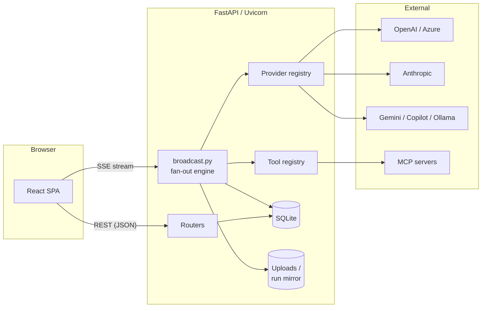
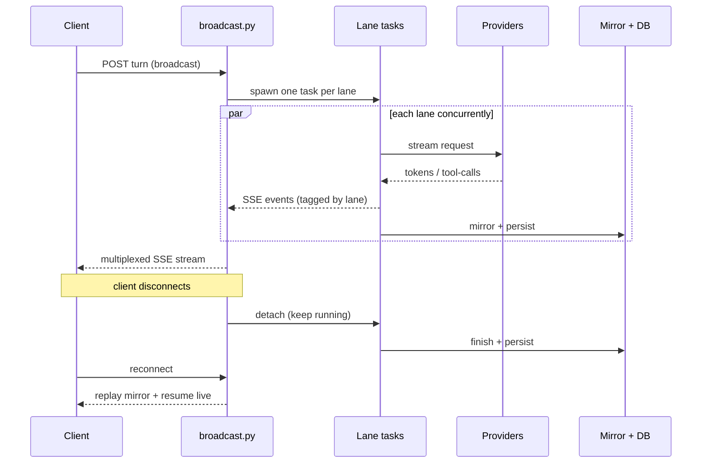

# MultiChat — Technical Specification

This document explains how MultiChat is put together: the high-level architecture, the
streaming fan-out engine, the data model, and the lifecycle of a broadcast request. It's
aimed at contributors who want to understand or extend the codebase.

> For setup and day-to-day dev commands, see [CONTRIBUTING.md](../CONTRIBUTING.md).

---

## 1. Overview

MultiChat is a **local-first, multi-model chat workbench**. A single prompt is broadcast
to 2–6 model *lanes*, each streaming its answer concurrently over Server-Sent Events
(SSE). A optional **Judge** lane synthesizes the answers, models can call **tools**, and
usage is tracked on an **Insights** dashboard.

| Layer | Stack |
| --- | --- |
| **Frontend** | React 18 · Vite · TypeScript · Tailwind · TanStack Query · React Router |
| **Backend** | Python 3.11 · FastAPI · Uvicorn · SQLAlchemy 2 · Pydantic v2 · httpx (async) |
| **Streaming** | `asyncio` fan-out → SSE, with a disk-backed mirror for resume |
| **Storage** | SQLite (default) · local filesystem for uploads & run mirrors |
| **Auth** | bcrypt password hashing · JWT bearer tokens · Fernet-encrypted secrets at rest |

---

## 2. Architecture

- **Frontend** talks to the backend two ways: ordinary **REST/JSON** for CRUD (sessions,
  providers, personas, snippets, evals) and a long-lived **SSE stream** for live token
  fan-out. Server state is cached with TanStack Query.
- **Backend** is a FastAPI app. Routers under `backend/app/routers/` own the REST surface;
  the streaming engine lives in `backend/app/broadcast.py`.
- **Providers** are normalized behind a common interface (`providers/base.py`) and built
  by `providers/registry.py`, so a lane doesn't care whether it's OpenAI, Anthropic,
  Gemini, Copilot, Ollama, or an OpenAI-compatible endpoint.
- **Tools** are registered in `tools/registry.py`; `web_search`, `fetch_url`, and the
  `calculator` are built in, and external **MCP** servers plug in via `mcp/client.py`.

---

## 3. Streaming fan-out engine

The heart of MultiChat is `broadcast.py`. When a turn is broadcast:

1. **One SSE response, many lanes.** The client opens a single SSE connection for the
   turn. The server starts one `asyncio` task per lane and multiplexes their events onto
   that stream, tagging each event with its `lane_id`.
2. **Concurrent generation.** Each lane task builds its provider, streams tokens, and
   emits `token`, `reasoning`, `tool_call`, `error`, and `done` events as they happen.
3. **Disk-backed mirror.** Every lane's output is mirrored to local storage as it streams.
   This is what makes runs **resumable**.
4. **Detached / background tasks.** If the client disconnects mid-run, the lane task is
   *detached* rather than cancelled — a strong reference is held in `_detached_tasks` so
   the event loop won't garbage-collect (and thereby cancel) it. The lane finishes
   server-side and persists its result. A safety cap limits how many detached tasks may
   run at once.
5. **Resume.** On reconnect, the client replays the mirror to catch up, then continues
   receiving live events for any lanes still generating.
6. **Cancellation.** A per-`(session_id, lane_id)` `asyncio.Event` registry lets a client
   stop an individual lane without touching the others.

---

## 4. Tool calling

- Models emit normalized tool-call requests through the provider layer.
- `tools/registry.py` resolves which tools are enabled for a lane; each tool implements a
  common `base.py` contract and receives a `ToolContext`.
- Arguments are repaired/normalized (`tools/argfix.py`) before execution to tolerate
  partial or flattened JSON from models.
- **Egress safety:** `fetch_url` and `web_search` go through an SSRF guard (`tools/ssrf.py`)
  that blocks private/loopback/link-local targets and caps response size.
- **MCP:** external Model Context Protocol servers are launched and proxied by
  `mcp/client.py`; their tools appear alongside the built-ins.
- Each call is persisted as a `ToolCall` row so the reasoning + tool-call timeline
  survives reloads.

---

## 5. Data model

Core SQLAlchemy models (`backend/app/models.py`):

| Model | Role |
| --- | --- |
| `User` | Account; owns everything. Auth via bcrypt hash. |
| `Provider` | A configured model provider (API key or OAuth). Secrets Fernet-encrypted. |
| `Session` (chat) | A conversation; a single chat is just a one-lane session. |
| `Lane` | One model column within a session. |
| `Turn` | One broadcast (a user prompt fanned out to the lanes). |
| `LaneMessage` | A lane's message within a turn (assistant/user/system). |
| `ToolCall` | A persisted tool invocation attached to a lane message. |
| `Attachment` / `GeneratedFile` | Uploaded and tool-generated files (local storage). |
| `ToolCredential` | Encrypted secrets for tools/integrations. |

All data routes are **owner-scoped**: a request for another user's resource returns `404`,
not `403`, to avoid leaking existence.

---

## 6. Request lifecycle (a broadcast)

1. Client `POST`s a turn to the session's REST endpoint → a `Turn` and per-lane
   `LaneMessage` rows are created.
2. Client opens the SSE stream for that turn.
3. `broadcast.py` spawns a lane task per lane; each builds its provider and streams.
4. Tokens/tool-calls/reasoning stream to the client (tagged by lane) and are mirrored +
   persisted.
5. On `done`, final content, token counts, and metrics (latency, TTFT, tok/s) are saved.
6. Analytics endpoints later aggregate these rows for the Insights dashboard.

---

## 7. Auth & secrets

- **Passwords:** bcrypt (passlib).
- **Sessions:** JWT bearer tokens (24h). A weak or absent `JWT_SECRET` is replaced at
  startup with a generated secret persisted outside the repo (see `security.py`).
- **Provider/tool secrets:** encrypted at rest with Fernet (`crypto.py`), keyed by
  `APP_ENCRYPTION_KEY`. Secrets are never returned to the browser — responses expose only
  a mask and a `has_key` flag.

See the [Security notes](../README.md#-security-notes) in the README for the threat model
and known limitations.

---

## 8. Frontend structure

| Path | Role |
| --- | --- |
| `src/pages/ComparePage.tsx` | The main multi-lane compare/chat view. |
| `src/hooks/useBroadcast.ts` | Consumes the SSE stream; batches token updates to avoid re-rendering the grid every token. |
| `src/components/LaneColumn.tsx` | A single model lane. |
| `src/components/MessageRenderer.tsx` | Markdown/code/mermaid/table rendering. |
| `src/pages/{Analytics,Evals,Integrations,...}Page.tsx` | Settings sub-pages. |
| `src/api/` | Typed REST client + shared types. |

---

## 9. Local development

- **Frontend:** `npm --prefix frontend run dev` (Vite, port 5000). Validate with
  `npm run typecheck` and `npm run build`.
- **Backend:** Uvicorn on port 5001. Byte-compile check: `python -m compileall app`.
- **CI** (`.github/workflows/ci.yml`) runs the frontend typecheck + build and the backend
  byte-compile on every push/PR to `main`.
